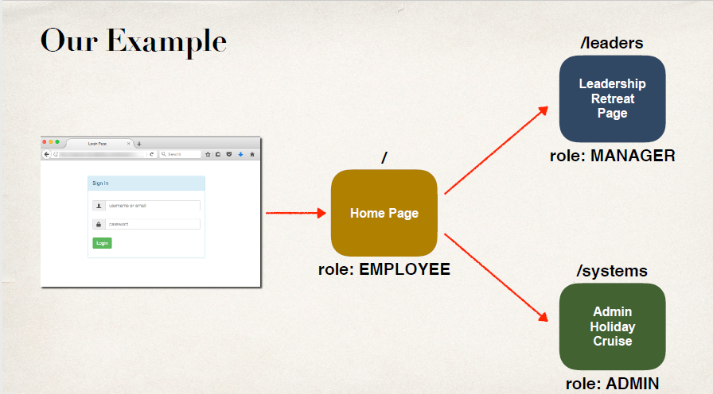
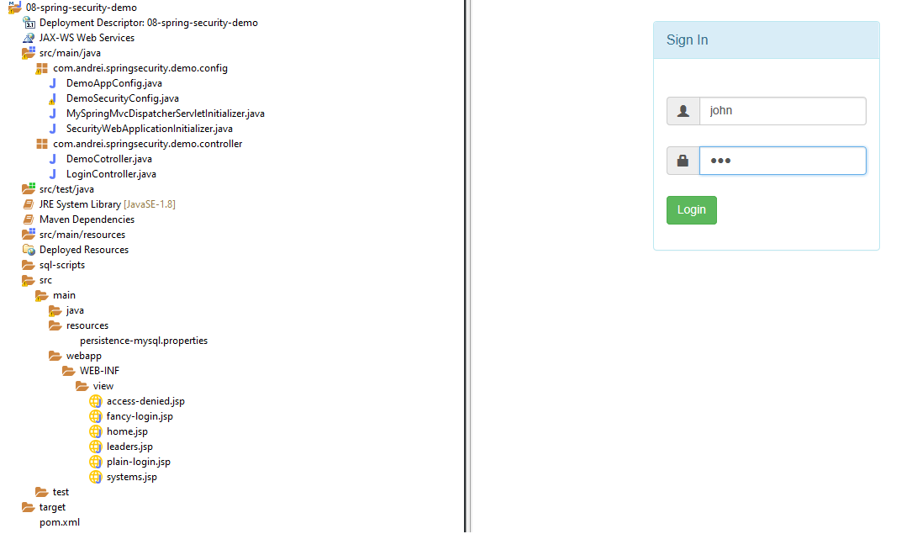

# 08-spring-security-demo
Spring Security Learning Project.  
Display content based on roles. User account stored in database.  
  
  
    
Spring security config two classes:  
  - AbstractSecurityWebApplicationInitializer.java  
  - WebSecurityConfigurerAdapter.java  

Spring Security flash: 
 - two config classes (initializer and @Configuration); --> activate Security Filter --> loggin page (default or personal) ;
 - error, logout – param send back via url, can be used in jsp page;
 - form:form - protects  against Sea Surf(CSRF) with randomly generated token for each request; POST method;
 - predefine names: username, password , authorities,  
 - spring security predefine table schemas:2 tables users(PK username, password, enabled), authorities(username, authoitie)  
 
 

Notes:  
Java config, no web.xml and no spring-mvc-demo-servlet.xml, instead two casses:  
  - AbstractAnnotationConfigDispatcherServletInitializer.java  
  - DemoAppConfig.java  

Maven project:  
  - pure java config => no web.xml => must add: maven-war-plugin in pom.xml     

To run in eclipse:  
  - import as maven project,
  - Run As ->Run on Server 
user: john, mary, susan; password 123

pom.xml   
  - dependency  
      - Sping MVC support: spring-web-mvc;
      - Spring security support: spring-security-web; spring-security-config; spring-security-taglibs;
      - MySQL, C3P0 support: mysql-connector-java; c3p0;
      - Servlet, JSP and JSTL support: javax.servlet-api; javax.servlet.jsp-api; jstl;
  - plugins  
      - maven-war-plugin

user bcrypt password: 123  bcrypt-generator.com  
Initial commit. Basic Spring Security demo app with Default Login Form. User account strored in memory.    

[BACK TO START PAGE](https://github.com/FlorescuAndrei/Start.git) 

